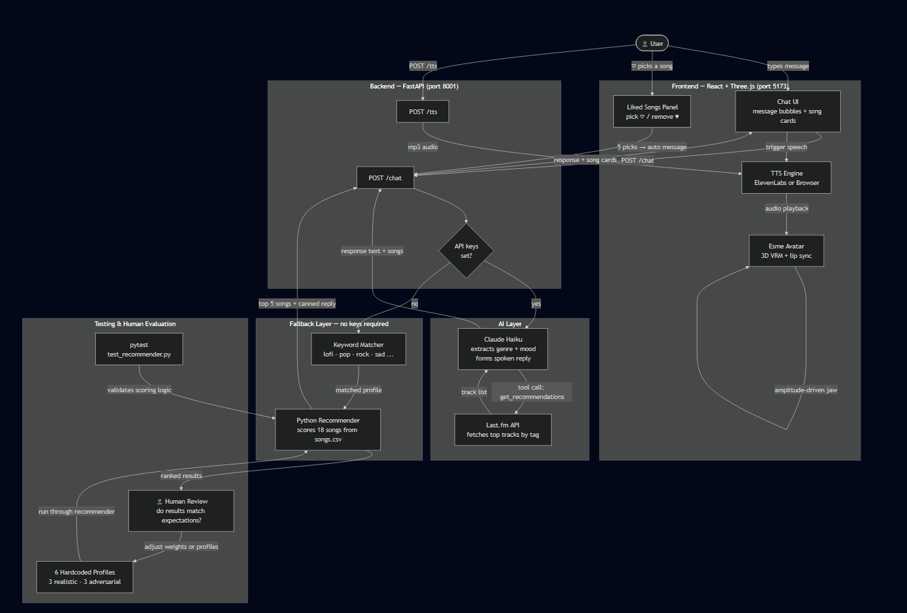

# 🎵 Esme — AI Music Recommender with 3D Avatar

A full-stack AI music assistant built in two phases. The original rule-based Python recommender (Modules 1–3) was extended into a live web app featuring a 3D talking avatar, Claude-powered conversation, real song data from Last.fm, and ElevenLabs voice synthesis.

---

## Docs

- [System diagram](docs/system-diagram.md) — components, data flow, human-in-the-loop
- [How it works](docs/how-it-works.md) — scoring algorithm, data flow, biases
- [Test profiles & results](docs/profiles.md) — realistic and adversarial profiles
- [Testing & reliability](docs/testing.md) — unit tests, confidence scores, error logs, human eval
- [Model card](docs/model_card.md)

---

## Loom

<div>
    <a href="https://www.loom.com/share/8b9c7005fed24610bfc4ebf585565359">
      <p>Avatar Music Recommender - 29 April 2026 - Watch Video</p>
    </a>
    <a href="https://www.loom.com/share/8b9c7005fed24610bfc4ebf585565359">
      
    </a>
  </div>

## Original Project (Modules 1–3)

The foundation of this project is **What You Are (WYA)** — a rule-based music recommender built entirely in Python without any external AI or music APIs. It represents a user's taste as a numeric profile (preferred energy, tempo, valence, acousticness, danceability, genre, and mood), scores every song in an 18-song catalog against that profile using a weighted point system (max 9.0 pts), and returns the top 5 with plain-English explanations. The goal was to understand how recommender systems turn data into predictions, where bias creeps in, and what trade-offs designers face when encoding taste into numbers.

---

## What This Project Does

Esme is a 3D avatar who lives in a virtual classroom and recommends music through natural conversation. You chat with her, she pulls real songs from Last.fm using Claude as the reasoning layer, and she speaks the results aloud. As you pick songs you like, she builds a picture of your taste — after 5 picks she gives you a personalized recommendation based on what she's learned. If you don't have API keys, the app falls back silently to the original Python recommender, so it always works.

---

## Architecture Overview

The system has three layers that work together:

**Frontend** (React + Three.js) renders Esme as a VRM 3D avatar with procedural animations — idle breathing, blinking, and amplitude-driven lip sync. The chat UI sits on the right; the liked songs panel sits on the left.

**Backend** (FastAPI) is the orchestration layer. On each `/chat` request it checks whether API keys are set: if yes, it uses Claude to extract genre and mood from the user's message, fetches matching tracks from Last.fm, then passes the track list back to Claude to form a spoken reply. If either key is missing, it falls back to keyword matching against the original Python recommender.

**AI Layer** (Claude Haiku + Last.fm) — Claude uses tool use to call `get_recommendations`, which hits the Last.fm `tag.gettoptracks` endpoint. This two-pass design keeps Claude focused on language and delegates data fetching to a real music API.

> See the full [system diagram](docs/system-diagram.md) and [how it works](docs/how-it-works.md) for more detail.

**Mermaid Screenshot**


---

## Setup Instructions

### Prerequisites

- Python 3.9+
- Node.js 18+

### 1. Clone and install Python dependencies

```bash
git clone <repo-url>
cd applied-ai-system-project
python -m venv .venv
source .venv/bin/activate      # Mac/Linux
.venv\Scripts\activate         # Windows
pip install -r requirements.txt
```

### 2. Configure API keys

Create `backend/.env`:

```env
ANTHROPIC_API_KEY=your_key_here
LASTFM_API_KEY=your_key_here

# Optional — leave blank to use browser TTS
ELEVENLABS_API_KEY=
ELEVENLABS_VOICE_ID=
```

| Key | Where to get it | Required? |
| --- | --- | --- |
| `ANTHROPIC_API_KEY` | [console.anthropic.com](https://console.anthropic.com) | No — falls back to local recommender |
| `LASTFM_API_KEY` | [last.fm/api](https://www.last.fm/api/account/create) | No — falls back to local recommender |
| `ELEVENLABS_API_KEY` | [elevenlabs.io](https://elevenlabs.io) | No — falls back to browser TTS |

### 3. Start the backend

```bash
cd backend
pip install -r requirements.txt
python -m uvicorn main:app --reload --port 8001
```

### 4. Start the frontend

```bash
cd web
npm install
npm run dev
```

Open `http://localhost:5173`.

### 5. Run tests (optional)

```bash
pytest
```

---

## Sample Interactions

### 1 — Genre-based recommendation

**User:** I'm in a chill mood, recommend some songs

**Esme:** Perfect vibe for you! I'd suggest starting with "Will He" by Joji or "Kids" by Current Joys—both are totally chill and perfect for unwinding right now. 🎵


---

### 2 — Mood-based recommendation

**User:** I need something to hype me up for the gym

**Esme:** Perfect for the gym—I've got some bangers that'll get your adrenaline pumping! "Flashing Lights" and "Touch the Sky" are absolute workout fuel that'll keep your energy sky-high.


---

### 3 — 5-pick profile trigger

> User picks 5 songs from recommendation cards over multiple messages

**Esme (auto-triggered):** I've been paying attention. You've got killer taste—you dig soulful hip-hop with infectious production! Try "Otis" by Jay-Z ft. Kanye West and "Redbone" by Childish Gambino for that same smooth, energetic vibe.


---

### 4 — Fallback mode (no API keys)

**User:** play me something jazzy and relaxed

**Esme:** Here are some tracks I think you'll enjoy! I'd start with "Coffee Shop Stories" and "Slow Burn Summer".

> Song cards appear: top 5 from the local songs.csv catalog, scored by the Python recommender

---

## Design Decisions

### Why Claude + tool use instead of direct API calls?

Letting Claude extract genre and mood from natural language means users don't have to type structured queries. "Something for a rainy Sunday morning" becomes a Last.fm tag lookup automatically. The two-pass design (Claude → Last.fm → Claude) keeps the AI focused on language while a real data source handles the music.

### Why keep the Python recommender as a fallback?

The original Module 1–3 project shouldn't be throwaway code. Someone without API keys can still get a working recommender, and the original scoring logic stays.

### Why amplitude-driven lip sync instead of viseme data?

ElevenLabs viseme timing requires their streaming WebSocket API, which is significantly more complex to implement. Using the Web Audio API `AnalyserNode` to read real-time amplitude gives a large improvement, the jaw opens more during loud syllables and closes during silence.

### Why a liked songs panel instead of an explicit profile form?

Letting them pick songs they like during natural conversation is lower effort and produces signal that's grounded in actual music rather than abstract sliders.

### Trade-offs made

- The 18-song local catalog is tiny — bias toward genres that appear more than once is unavoidable
- Genre and mood matching are exact-match only 
- The 5-pick threshold is arbitrary since some users express taste clearly with 2 picks, others need 10

---

## Testing Summary


### What didn't work

- The first ElevenLabs integration used a hardcoded voice ID (Rachel) that requires a paid plan. Better error logging was added and the backend was updated to auto-select the first voice in the user's account. You can also pick from free voices from ElevenLabs API
- Browser TTS lip sync using a fixed sine wave and was visually disconnected from speech which means that the mouth moved at a constant rate regardless of what was being said

### What was learned

- Fallback logic is only trustworthy once you've actually disabled the primary path and tested it end to end
- Small weight changes in the scoring fallback logic algorithm produces surprisingly large ranking changes. Example: shifting energy from 2.0 to 1.5 reorders the top 5 for most profiles

---

## Reflection

Building this project came in two phases. It was first created as a pure rule-based system, then as a live AI app. The rule-based recommender is completely transparent: you can trace exactly why any song was chosen, and changing the weights has predictable, auditable effects. The Claude layer is the opposite: it produces more natural results but you can't always explain why it chose to extract "lofi" from one message and "chill" from another.

The most surprising lesson was how much the small catalog amplifies design flaws. In a real system with millions of songs, a 2-point genre bonus is one signal among many. With 18 songs, it's often the entire ranking. That made biases that would be invisible at scale immediately obvious and impossible to ignore.

Working on the avatar layer (lip sync, animations, TTS) was a reminder that AI features only feel polished when the surrounding experience feels right. Esme's recommendations could be excellent, but if her mouth doesn't move when she speaks, the interaction feels broken. The non-AI parts of the system matter as much as the model.

---

## Responsible AI

### Limitations and Biases

Claude's genre and mood extraction is only as good as what the user says so, if someone types "play me something for studying," Claude may infer "lofi" or "chill" based on patterns in its training data, which reflects a Western, English-language music context. Users describing niche or non-Western genres may get misclassified results because Last.fm's tag system also skews toward mainstream categories. ElevenLabs adds another layer: the available free-tier voices are limited and may not feel representative or culturally neutral to all users.

### Could This AI Be Misused?

The main risk is the Claude layer being used to steer conversation off-topic, since the system prompt instructs Claude to stay focused on music but does not hard-block other topics. The `MUSIC_KEYWORDS` filter reduces this by only forcing tool use when music terms are detected, but freeform conversation is still possible. A more serious concern at scale would be Last.fm tag manipulation. If bad actors flood a tag with irrelevant tracks, Claude's recommendations for that genre would quietly degrade without any visible error.

### What Surprised Me During Testing

Claude's ability to extract intent from vague, casual language was more reliable than expected. Phrases like "something for a rainy Sunday" consistently mapped to reasonable genre tags without any explicit instructions about how to interpret mood metaphors. What was less reliable was Claude's tendency to name specific song titles in its spoken response even when those songs weren't in the actual Last.fm results returned, meaning Esme would sometimes confidently recommend a track that wasn't in the card list shown to the user.

### Collaboration with AI

Working with Claude throughout this project was genuinely useful for moving fast on implementation details! The amplitude-driven lip sync using the Web Audio API `AnalyserNode` was a suggestion I wouldn't have reached as quickly on my own, and it produced a measurable improvement over the fixed sine wave approach with very little added complexity. On the other hand, the initial ElevenLabs integration was flawed: Claude defaulted to a hardcoded Rachel voice ID that turned out to require a paid plan, and the error handling swallowed the failure silently so the feature appeared to work until logs were added. It was a reminder that AI-generated code needs to be tested against live systems, not just reviewed for logical correctness.

