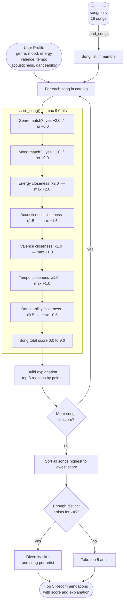
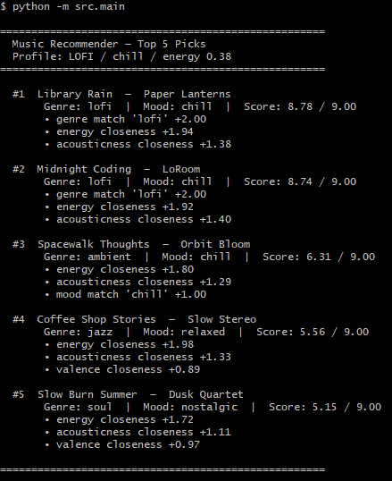
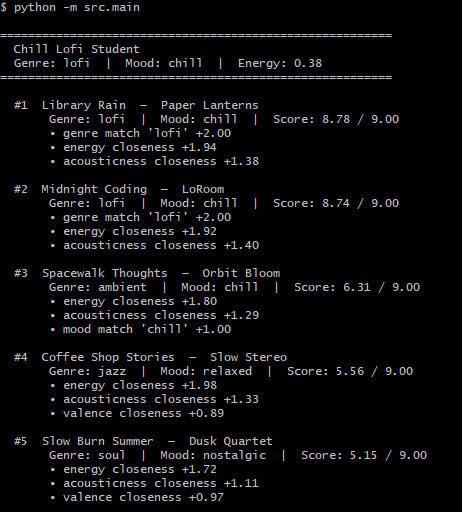
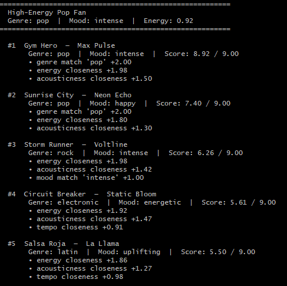
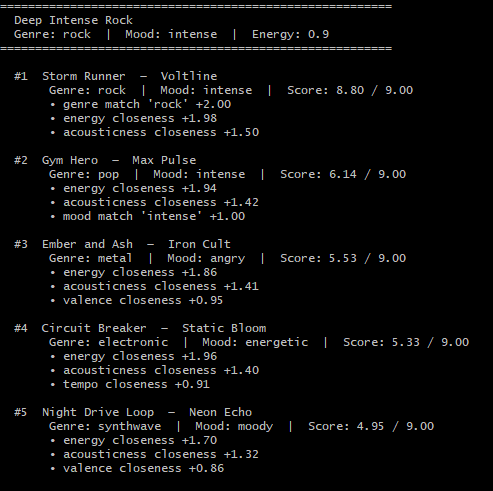
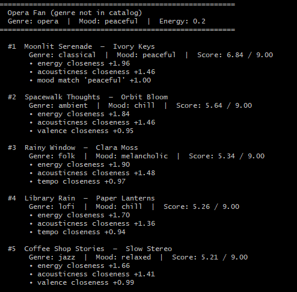
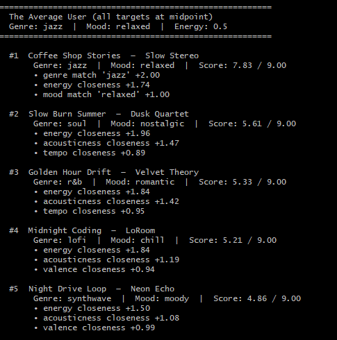

# 🎵 Music Recommender Simulation

## Project Summary

In this project you will build and explain a small music recommender system.

Your goal is to:

- Represent songs and a user "taste profile" as data
- Design a scoring rule that turns that data into recommendations
- Evaluate what your system gets right and wrong
- Reflect on how this mirrors real world AI recommenders

Replace this paragraph with your own summary of what your version does.

---

## How The System Works

The system works like a friend who knows your taste in music. You tell them what kind of songs you like, and they go through a catalog to find the ones that match your vibe as closely as possible.

### What each Song knows about itself

Every song in the catalog carries two types of information:

- *Audio feel*: energy (how intense or calm), valence (how happy or sad it sounds), danceability, tempo (speed in beats per minute), and acousticness (how organic vs. electronic it sounds)
- *Labels*: genre (e.g., pop, lofi, rock), mood (e.g., happy, chill, intense), artist, and title

### What the User Profile stores

The user profile is a snapshot of your taste:

- Your preferred level for each audio feature — for example, “I like high-energy, happy-sounding, very danceable songs”
- Your preferred genres and moods (e.g., pop and lofi; happy and chill)
- How much each feature matters to you (so genre can count more than tempo if you care more about style than speed)

### Algorithm Recipe

Every song in the catalog is scored against the user profile using a point system. Points are added up — the highest total wins. The maximum possible score is **9.0 points**.

| Feature | Max points | How it is calculated |
| --- | --- | --- |
| Genre match | +2.0 | Full points if the song's genre exactly matches the user's favorite genre; zero otherwise |
| Energy | +2.0 | Full points if energy is identical to the target; fewer points the further away it is |
| Acousticness | +1.5 | Same closeness logic — rewards organic/acoustic songs for acoustic-leaning users |
| Mood match | +1.0 | Full points if the mood label matches exactly; zero otherwise |
| Valence | +1.0 | Closeness to the user's preferred happy-vs-sad level |
| Tempo | +1.0 | Closeness to the user's preferred BPM, normalized across the catalog's speed range |
| Danceability | +0.5 | Tiebreaker only — it overlaps a lot with energy, so it counts least |

**Why genre outweighs mood (+2.0 vs +1.0):** Genre captures a stable, consistent sound — lofi and metal are worlds apart even if both happen to be labeled "intense." Mood labels are more subjective and inconsistent, so they count half as much.

**Why energy and acousticness are the top numeric features:** Together they define the core "vibe" of a song — how calm or intense it feels, and how organic or electronic it sounds. A user who wants quiet, acoustic study music will be correctly steered away from loud electronic tracks even if the genre or mood label is missing.

### How the final recommendations are chosen

1. Every song in the catalog gets a score
2. Songs are sorted from highest to lowest score
3. A diversity check runs: if two top songs are by the same artist, the lower-ranked one is skipped so the list feels more varied
4. The top 5 songs after that check become the recommendations

### Known biases and limitations

- **Genre lock-in.** Because genre is worth +2.0 — more than any single numeric feature — a song in the wrong genre will almost never reach the top 5, even if it is a near-perfect match on every audio feature. A deeply acoustic, slow, melancholic *pop* song will lose to a mediocre *lofi* track for a "lofi" user.

- **Exact-match only for categories.** Genre and mood are all-or-nothing. A user who likes "lofi" gets zero credit for an "ambient" song, even though the two genres sound nearly identical. There is no partial credit for close categories.

- **Single target per feature.** The profile stores one preferred energy level, one preferred tempo, etc. A user whose taste varies by time of day (upbeat in the morning, chill at night) cannot express that nuance — the system picks an average that may satisfy neither mood.

- **Small catalog amplifies all of the above.** With only 18 songs, a bias toward one genre can eliminate most of the catalog immediately. In a real system with millions of tracks this effect is diluted; here it is stark.

### Data flow diagram



---

### Sample Terminal Output



### Different Profiles







#### Realistic profiles

| Profile | #1 result | Why it makes sense |
| --- | --- | --- |
| Chill Lofi Student | Library Rain (8.78) | Exact genre + mood match, near-perfect energy and acousticness |
| High-Energy Pop Fan | Gym Hero (8.92) | Only song with genre, mood, and energy all matching simultaneously |
| Deep Intense Rock | Storm Runner (8.80) | Only rock/intense song; locks in both genre and mood bonuses |

#### Adversarial profiles — what they expose

| Profile | Interesting finding |
| --- | --- |
| Conflicted (high energy + melancholic) | "Ember and Ash" wins at 8.72 with genre + energy match. But #2 is rock, not metal — the valence mismatch (wanting 0.15, rock has 0.48) costs ~0.66 pts but doesn't knock it out of the top 5. Energy dominates. |
| Missing genre (opera) | Genre bonus never fires. The ranking falls back entirely on numeric features. Moonlit Serenade rises to #1 on mood match + near-zero energy + near-perfect acousticness — correct result, no genre label needed. |
| Average user (all 0.5) | Scores compress: #1 gets 7.83, #2 drops to 5.61. Without strong numeric preferences, the only differentiator is whether a genre or mood bonus fires — exposing how much the system relies on categorical matches. |


## Getting Started

### Setup

1. Create a virtual environment (optional but recommended):

   ```bash
   python -m venv .venv
   source .venv/bin/activate      # Mac or Linux
   .venv\Scripts\activate         # Windows

2. Install dependencies

```bash
pip install -r requirements.txt
```

3. Run the app:

```bash
python -m src.main
```

### Running Tests

Run the starter tests with:

```bash
pytest
```

You can add more tests in `tests/test_recommender.py`.

---

## Running the Full Project

The project has three independent pieces. Start them in this order:

### 1. Python recommender CLI (optional, standalone check)

```bash
pip install -r requirements.txt
python -m src.main
```

### 2. Backend — FastAPI server (port 8001)

```bash
cd backend
pip install -r requirements.txt
python -m uvicorn main:app --reload --port 8001
```

### 3. Frontend — React + Three.js (port 5173)

```bash
cd web
npm install
npm run dev
```

Then open `http://localhost:5173` in your browser to see the Esme avatar chat interface.

---

## API Keys Required

The backend needs two keys. Create a file at `backend/.env` with the following content:

```env
ANTHROPIC_API_KEY=your_anthropic_key_here
LASTFM_API_KEY=your_lastfm_key_here
```

| Key | What it's for | Where to get it |
| --- | --- | --- |
| `ANTHROPIC_API_KEY` | Powers Esme's chat responses via Claude | [console.anthropic.com](https://console.anthropic.com) |
| `LASTFM_API_KEY` | Fetches real song recommendations from Last.fm | [last.fm/api](https://www.last.fm/api/account/create) — free account required |

The backend will return a 500 error on `/chat` or `/recommend` if either key is missing or not loaded.


