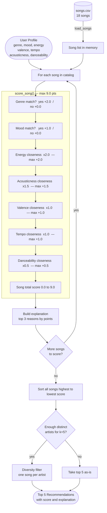

# How The System Works

The system works like a friend who knows your taste in music. You tell them what kind of songs you like, and they go through a catalog to find the ones that match your vibe as closely as possible.

---

## What each Song knows about itself

Every song in the catalog carries two types of information:

- *Audio feel*: energy (how intense or calm), valence (how happy or sad it sounds), danceability, tempo (speed in beats per minute), and acousticness (how organic vs. electronic it sounds)
- *Labels*: genre (e.g., pop, lofi, rock), mood (e.g., happy, chill, intense), artist, and title

---

## What the User Profile stores

The user profile is a snapshot of your taste:

- Your preferred level for each audio feature — for example, "I like high-energy, happy-sounding, very danceable songs"
- Your preferred genres and moods (e.g., pop and lofi; happy and chill)
- How much each feature matters to you (so genre can count more than tempo if you care more about style than speed)

---

## Algorithm Recipe

Every song in the catalog is scored against the user profile using a point system. Points are added up — the highest total wins. The maximum possible score is **9.0 points**.

| Feature | Max points | How it is calculated |
| --- | --- | --- |
| Genre match | +2.0 | Full points if the song's genre exactly matches the user's favorite genre; zero otherwise |
| Energy | +2.0 | Full points if energy is identical to the target; fewer points the further away it is |
| Acousticness | +1.5 | Same closeness logic — rewards organic/acoustic songs for acoustic-leaning users |
| Mood match | +1.0 | Full points if the mood label matches exactly; zero otherwise |
| Valence | +1.0 | Closeness to the user's preferred happy-vs-sad level |
| Tempo | +1.0 | Closeness to the user's preferred BPM, normalized across the catalog's speed range |
| Danceability | +0.5 | Tiebreaker only — it overlaps a lot with energy, so it counts least |

**Why genre outweighs mood (+2.0 vs +1.0):** Genre captures a stable, consistent sound — lofi and metal are worlds apart even if both happen to be labeled "intense." Mood labels are more subjective and inconsistent, so they count half as much.

**Why energy and acousticness are the top numeric features:** Together they define the core "vibe" of a song — how calm or intense it feels, and how organic or electronic it sounds. A user who wants quiet, acoustic study music will be correctly steered away from loud electronic tracks even if the genre or mood label is missing.

---

## How the final recommendations are chosen

1. Every song in the catalog gets a score
2. Songs are sorted from highest to lowest score
3. A diversity check runs: if two top songs are by the same artist, the lower-ranked one is skipped so the list feels more varied
4. The top 5 songs after that check become the recommendations

---

## Known biases and limitations

- **Genre lock-in.** Because genre is worth +2.0 — more than any single numeric feature — a song in the wrong genre will almost never reach the top 5, even if it is a near-perfect match on every audio feature. A deeply acoustic, slow, melancholic *pop* song will lose to a mediocre *lofi* track for a "lofi" user.

- **Exact-match only for categories.** Genre and mood are all-or-nothing. A user who likes "lofi" gets zero credit for an "ambient" song, even though the two genres sound nearly identical. There is no partial credit for close categories.

- **Single target per feature.** The profile stores one preferred energy level, one preferred tempo, etc. A user whose taste varies by time of day (upbeat in the morning, chill at night) cannot express that nuance — the system picks an average that may satisfy neither mood.

- **Small catalog amplifies all of the above.** With only 18 songs, a bias toward one genre can eliminate most of the catalog immediately. In a real system with millions of tracks this effect is diluted; here it is stark.

---

## Data flow diagram

