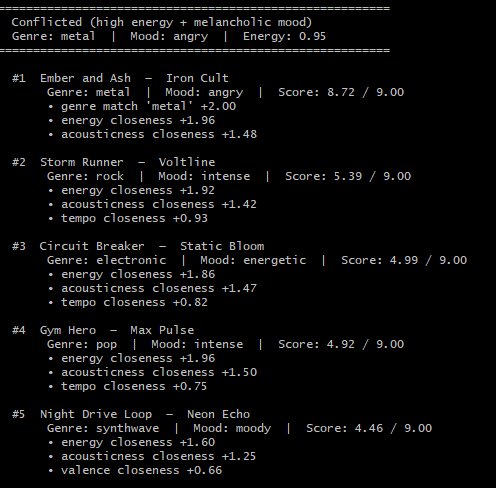

# Test Profiles & Results

## Sample Terminal Output

---

## Profile Results

---

## Realistic profiles

| Profile | #1 result | Why it makes sense |
| --- | --- | --- |
| Chill Lofi Student | Library Rain (8.78) | Exact genre + mood match, near-perfect energy and acousticness |
| High-Energy Pop Fan | Gym Hero (8.92) | Only song with genre, mood, and energy all matching simultaneously |
| Deep Intense Rock | Storm Runner (8.80) | Only rock/intense song; locks in both genre and mood bonuses |

---

## Adversarial profiles — what they expose

| Profile | Interesting finding |
| --- | --- |
| Conflicted (high energy + melancholic) | "Ember and Ash" wins at 8.72 with genre + energy match. But #2 is rock, not metal — the valence mismatch (wanting 0.15, rock has 0.48) costs ~0.66 pts but doesn't knock it out of the top 5. Energy dominates. |
| Missing genre (opera) | Genre bonus never fires. The ranking falls back entirely on numeric features. Moonlit Serenade rises to #1 on mood match + near-zero energy + near-perfect acousticness — correct result, no genre label needed. |
| Average user (all 0.5) | Scores compress: #1 gets 7.83, #2 drops to 5.61. Without strong numeric preferences, the only differentiator is whether a genre or mood bonus fires — exposing how much the system relies on categorical matches. |
